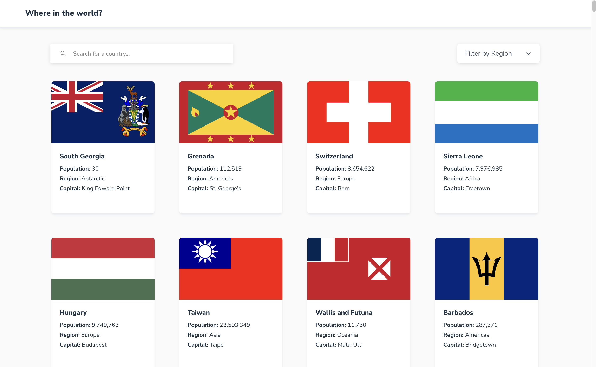
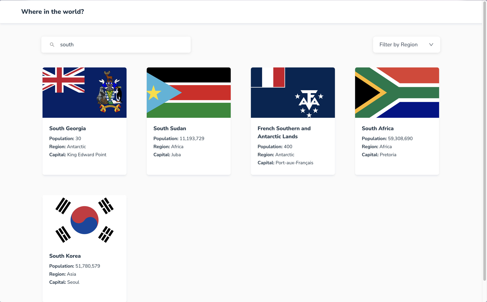
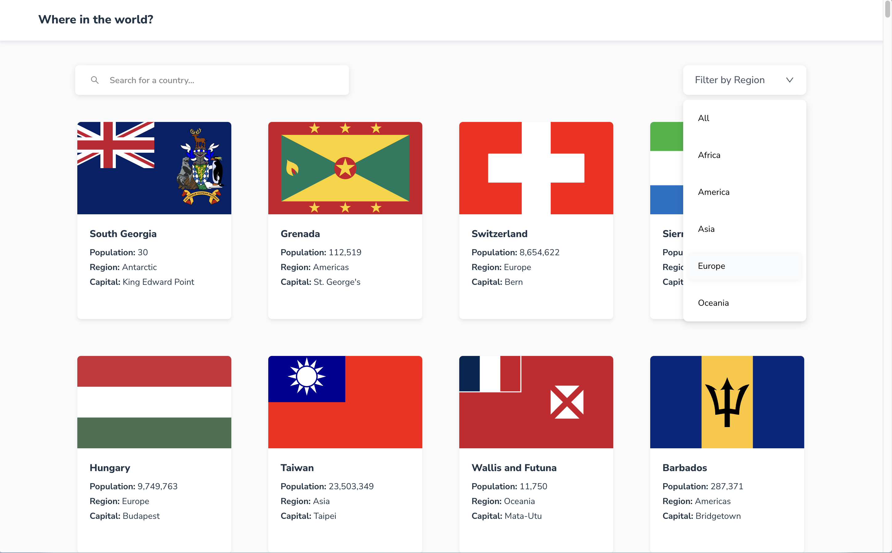
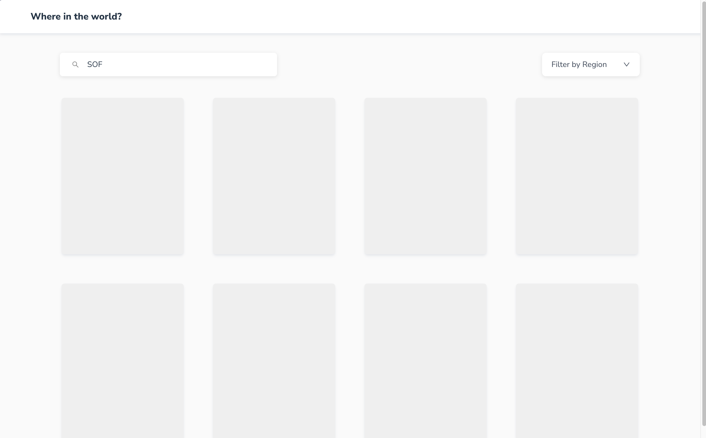
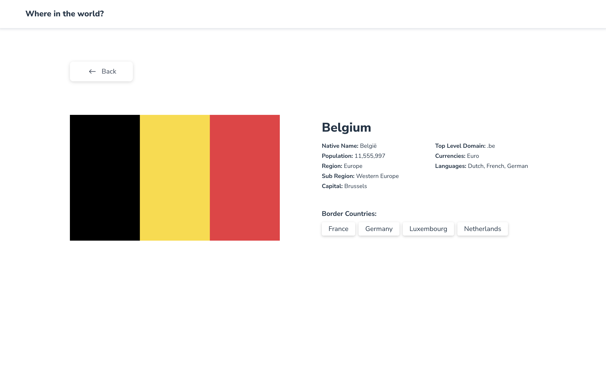

# Frontend Mentor - REST Countries API with color theme switcher solution

This is a solution to the [REST Countries API with color theme switcher challenge on Frontend Mentor](https://www.frontendmentor.io/challenges/rest-countries-api-with-color-theme-switcher-5cacc469fec04111f7b848ca). Frontend Mentor challenges help you improve your coding skills by building realistic projects.

## Table of contents

- [Overview](#overview)
    - [The challenge](#the-challenge)
    - [Screenshot](#screenshot)
    - [Links](#links)
- [My process](#my-process)
    - [Built with](#built-with)
    - [What I learned](#what-i-learned)
    - [Continued development](#continued-development)
- [Author](#author)
- [Question](#question)

## Overview

### The challenge

Users should be able to:

1. 메인에서 API로 불러온 모든 나라 보여주기 - [REST Countries API](https://restcountries.com/)
2. 나라 검색용 입력폼 필요
3. region 필터 기능 필요
4. 카드 클릭 시 해당 국가 디테일 페이지로 이동
5. 디테일 페이지에서 해당 국가와 국경을 맞대고 있는 다른 국가들의 링크 버튼으로 제공 + 클릭 시 상세 페이지로 이동
6. 라이트모드/다크모드 토글 추가 - 진행중
7. 반응형 (데스크탑/모바일) - 진행중

### Screenshot

1. 메인페이지

2. country 검색

3. 드롭다운 region 필터

4. loading UI

5. 디테일페이지

### Links

- Solution URL: [solution URL]()
- Live Site URL: [live site URL](https://fem-where-in-the-world.vercel.app/)

## My process

### Built with

- [React - Vite](https://ko.vite.dev/guide/)
- [TypeScript](https://www.typescriptlang.org/ko/)
- [Tailwind CSS](https://tailwindcss.com/)
- [Jotai](https://jotai.org/)
- [TanStack Query](https://tanstack.com/query/latest/docs/framework/react/overview)

### What I learned
추후 정리 예정

### Continued development

1. 전역 상태 라이브러리로 jotai를 선택했다.
기본적인 유틸만 사용해봤는데 시간날 때 공식문서를 정독해서 좀 더 딥하게 파봐야겠다.
2. tailwindCSS 더 공부해야겠다. 아직 갈 길이 먼 CSS 어린이.. 반성합니다.
3. 반응형은 필수!

## Author

- Github - [@choihyerln](https://github.com/choihyerln)
- Frontend Mentor - [@choihyerln](https://www.frontendmentor.io/profile/choihyerln)

## Question
1. 컴포넌트 경로 절대경로로 통일하는지? (상대경로가 짧다면 그걸로 대체하는지?)
