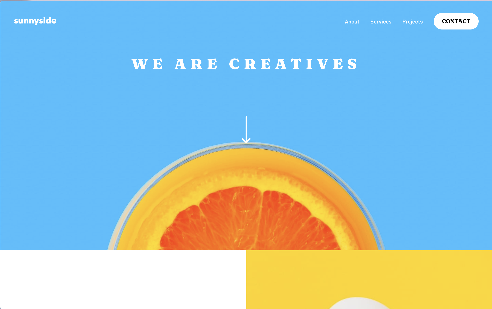
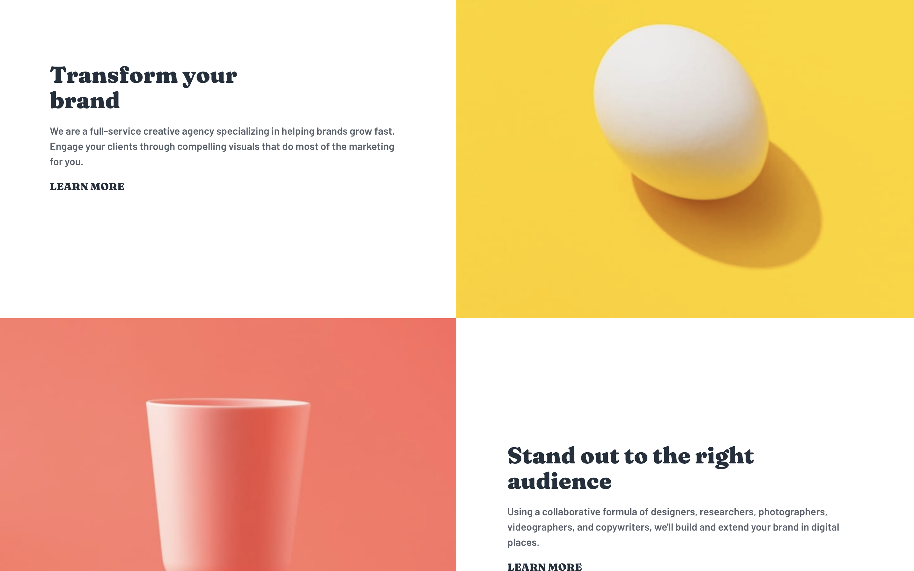
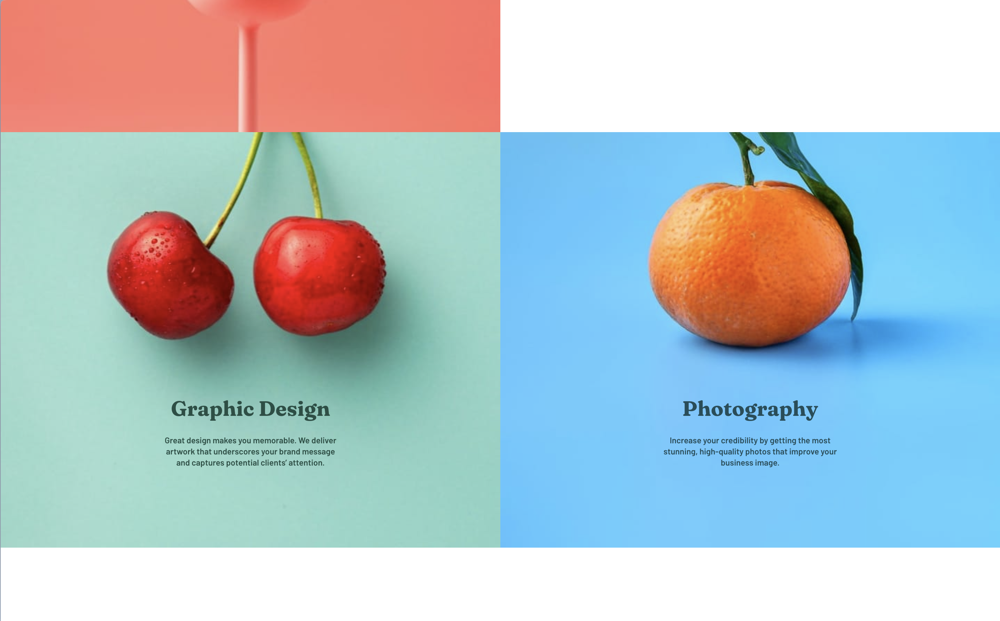
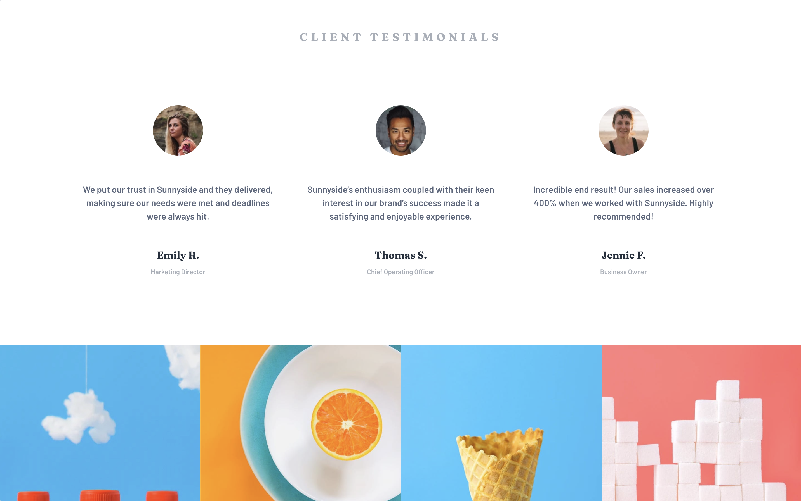
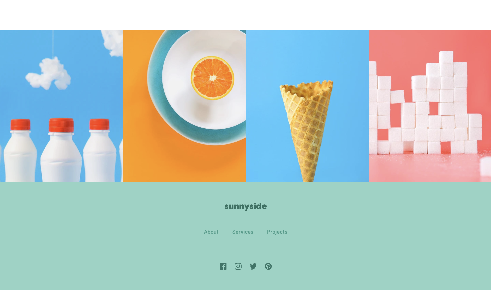

# Frontend Mentor - Sunnyside agency landing page solution

This is a solution to the [Sunnyside agency landing page challenge on Frontend Mentor](https://www.frontendmentor.io/challenges/sunnyside-agency-landing-page-7yVs3B6ef). Frontend Mentor challenges help you improve your coding skills by building realistic projects.

## Table of contents

- [Overview](#overview)
  - [The challenge](#the-challenge)
  - [Screenshot](#screenshot)
  - [Links](#links)
- [My process](#my-process)
  - [Built with](#built-with)
  - [What I learned](#what-i-learned)
  - [Continued development](#continued-development)
- [Author](#author)
- [Acknowledgments](#acknowledgments)

## Overview

### The challenge

Users should be able to:

- View the optimal layout for the site depending on their device's screen size
- See hover states for all interactive elements on the page

### Screenshot

### Links

- Solution URL: [solution URL]()
- Live Site URL: [live site URL](https://frontendmento-eam3.vercel.app/)

## My process

### Built with

- [React - Vite](https://ko.vite.dev/guide/)
- [TypeScript](https://www.typescriptlang.org/ko/)
- [Tailwind CSS](https://tailwindcss.com/)

### What I learned

### Continued development

mobile 버전 추가 예정

## Author

- Github - [@choihyerln](https://github.com/choihyerln)
- Frontend Mentor - [@choihyerln](https://www.frontendmentor.io/profile/choihyerln)

## Acknowledgments
